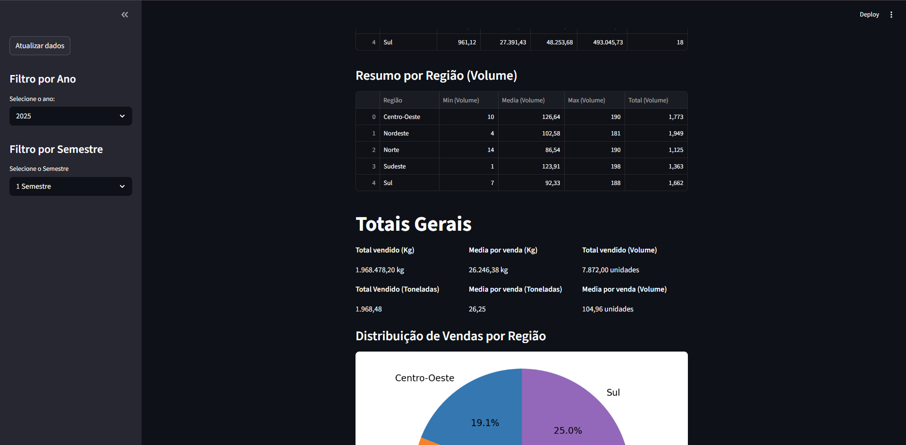

# SalesView — Dashboard de Analise de Vendas

Dashboard interativo desenvolvido com Streamlit para analise de desempenho da equipe de vendas externa, com comparativos por representante e regiao, filtros dinamicos e metricas totais.

---

## Problema Resolvido

Os dados de vendas dos representantes externos existiam apenas em planilhas Excel, sem uma forma rapida de comparar desempenho entre vendedores, regioes ou periodos. O SalesView transforma esses dados em tabelas e graficos interativos, permitindo que gestores identifiquem rapidamente os melhores e piores resultados sem precisar manipular planilhas manualmente.

---

## Funcionalidades

- Tabelas de resumo por representante em Kg: minimo, media, maximo, total e quantidade de vendas
- Tabelas de resumo por representante em volume (unidades)
- Tabelas de resumo por regiao em Kg e volume
- Metricas totais gerais: total e media em Kg, toneladas e volume
- Grafico de pizza com distribuicao percentual de vendas por regiao
- Filtros por ano e semestre na sidebar
- Botao de atualizacao dos dados sem reiniciar o servidor
- Formatacao numerica no padrao brasileiro

---

## Tecnologias

| Biblioteca | Uso |
|---|---|
| `streamlit` | Interface web interativa |
| `pandas` | Leitura, filtragem e agrupamento dos dados |
| `matplotlib` | Grafico de pizza |
| `openpyxl` | Engine de leitura do arquivo .xlsx |

---

## Instalacao

```bash
pip install pandas streamlit matplotlib openpyxl
```

---

## Uso

**Pelo terminal:**
```bash
streamlit run dashboard_vendas.py
```

**Pelo arquivo .bat (Windows):**

Clique duas vezes em `executar_dashboard.bat`. O dashboard abre automaticamente no navegador em `http://localhost:8501`.

---

## Estrutura esperada do Excel

Arquivo: `Pedido de Vendas - Logistica V2.xlsx`
Aba: `Pedidos de venda`

| Coluna | Descricao |
|---|---|
| Data Pedido | Data do pedido |
| Qtde Kg | Quantidade em quilogramas |
| Qtde Real | Quantidade em volume/unidades |
| Representante Master | Nome do vendedor |
| Regiao | Regiao geografica |
| Und. Negocio | Unidade de negocio (filtro aplicado: EQ. EXTERNA) |

---

## Screenshots

### Resumo por Representante


### Resumo por Regiao e Totais Gerais


---

## O que eu melhoraria

- Graficos de evolucao mensal por representante
- Ranking visual de vendedores com destaque para top e bottom performers
- Exportacao dos dados filtrados para Excel ou PDF
- Conexao direta com banco de dados ou ERP, eliminando a dependencia do Excel
- Deploy em servidor interno para acesso via navegador por qualquer colaborador

---

> Projeto desenvolvido para uso interno. Disponibilizado de forma generica, sem dados sensiveis.
